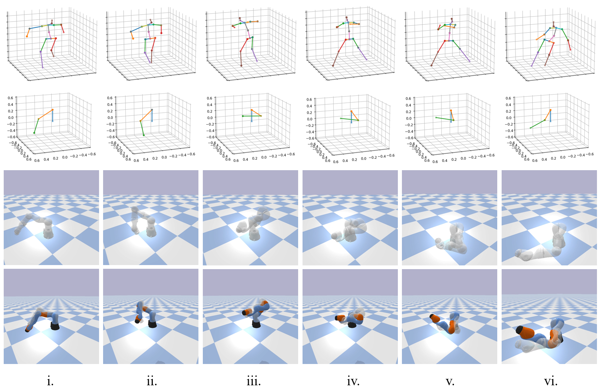
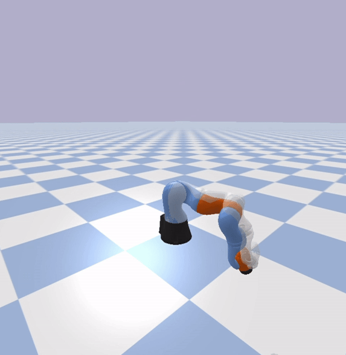

# Imitate Motions From Videos
Motion imitation is a challenging task in robotics and computer vision, typically requiring expert data obtained through MoCap devices. However, acquiring such data is resource-intensive in terms of financial resources, manpower, and time. Our project addresses this challenge by proposing a novel model that simplifies Motion Imitation into a prediction problem of joint angle values in reinforcement learning.

|  |  |
| --------------------------- | ------------------------------ |

## Installation & Setups
Clone the repository and cd to Imitation-main directory.
```bash
git clone https://github.com/iQiyuan/Imitation.git
cd Imitation-main
```
Install [conda](https://www.anaconda.com/) and create the provided conda virtual environment.
```bash
conda env create -f environment.yaml
conda activate MoIm
```
Download the pre-trained model for 3D Human Pose Estimation following the instructions in "Dataset Setup" and "Demo" from this [repository](https://github.com/Vegetebird/StridedTransformer-Pose3D).

## Extract and Retarget 3D Motions
Make sure the required pre-trained weights are downloaded and in the correct directory listed below.
```
./pose_est/lib/checkpoint/pose_hrnet_w48_384x288.pth
./pose_est/lib/checkpoint/yolov3.weights
```

Put the target video under this directory.
```
./pose_est/video/target_video_name.mp4 
```
Run the below commands to extract skeletal motions and retarget it.
```bash
python extract.py --video target_video_name.mp4
python retarget.py --video target_video_name
```
Expected outputs are under this directory.
```
./pose_est/output/target_video_name
./demo_data/target_video_name
```

## Train New Imitation Policy
Although the pre-trained weights are provided, you can always train a new imitation policy using the reference motion extracted in the previous step.
```bash
python train.py --GUI True --video target_video_name
```

## Test The Learned Policy
The extracted reference motions can also be used to test the learned policy, i.e. let the robotic manipulator imitate whatever arm motions demonstrated in the videos.
```bash
python test.py --GUI True --video target_video_name
```

## Policy Evaluation
The learned policy can be quantitatively evaluated.
```bash
python performance.py
python evaluate.py --GUI True --video target_video_name
```

# Planned Research Paper
We are currently preparing a research paper that will provide a detailed explanation of the proposed model, its implementation, experimental results, and future directions. Stay tuned for updates!

# Acknowledgement
The code for this project is based on modifications made to the following repositories. Thanks to the authors of these repositories for open-sourcing their work.

[OpenAi_baselines](https://github.com/openai/baselines)  
[PPO_PyTorch](https://github.com/nikhilbarhate99/PPO-PyTorch)  
[Motion_Imitation](https://github.com/erwincoumans/motion_imitation)  
[StridedTransformer](https://github.com/Vegetebird/StridedTransformer-Pose3D)  
[PyBullet_official_e.g.](https://github.com/bulletphysics/bullet3/tree/master)

# License
This project is licensed under the MIT License - see the LICENSE file for details.